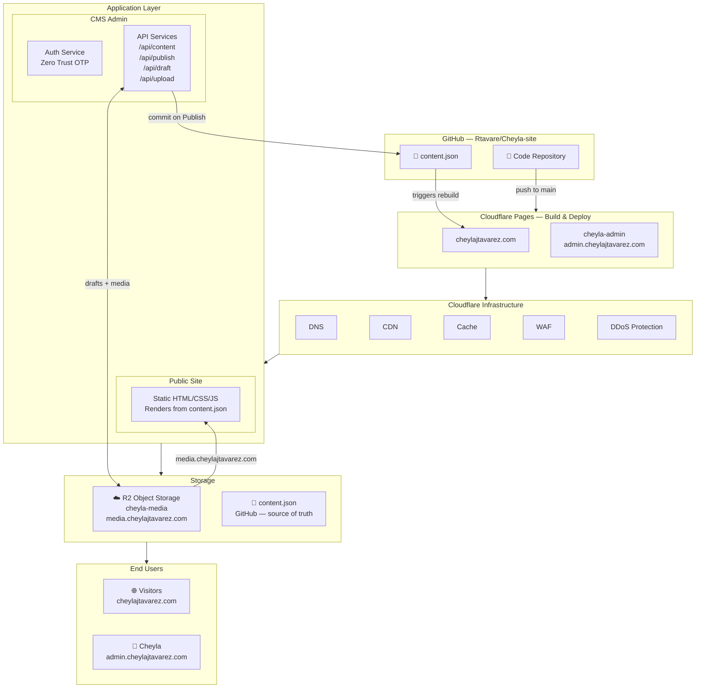

# Cheyla J Tavarez — Personal Site

Source for [cheylajtavarez.com](https://cheylajtavarez.com) — a personal brand and lifestyle site with a built-in CMS, hosted entirely on Cloudflare.

---

## Sites

| URL | What it is |
|-----|-----------|
| `cheylajtavarez.com` | Public-facing site |
| `admin.cheylajtavarez.com` | Content management (protected) |
| `media.cheylajtavarez.com` | Uploaded images and media (R2 CDN) |

---

## Stack

| Layer | Technology |
|-------|-----------|
| Hosting | Cloudflare Pages (two projects from this repo) |
| Frontend | Vanilla HTML / CSS / JS — no framework, no build step |
| Content | `content.json` — single source of truth for all site content |
| CMS | Custom single-page app at `admin.cheylajtavarez.com` |
| CMS Auth | Cloudflare Zero Trust Access — OTP email login |
| Media storage | Cloudflare R2 (`cheyla-media` bucket) |
| Draft storage | R2 (`draft.json`) — auto-saves every 3 seconds, cross-device |
| Contact form | Web3Forms (routes submissions to inbox) |
| Analytics | Cloudflare Web Analytics |

---

## Architecture



---

## How content publishing works

1. Cheyla logs into `admin.cheylajtavarez.com` via OTP email code
2. She edits content — changes auto-save to R2 every 3 seconds
3. Clicking **Publish** commits `content.json` to this repo via GitHub API
4. The commit triggers a Cloudflare Pages rebuild of the main site (~30–60s)
5. The public site re-renders with the updated content

---

## Repo structure

```
Cheyla-site/
├── index.html              ← Main public site (renders from content.json)
├── content.json            ← All site content (updated by CMS on Publish)
├── _headers                ← Cloudflare security + cache headers
├── STACK.md                ← Full technical reference
├── CLAUDE.md               ← AI assistant context
└── admin-site/
    ├── index.html          ← CMS single-page app
    ├── _headers            ← Admin security headers
    └── functions/api/
        ├── content.js      ← GET  /api/content   (read from GitHub)
        ├── publish.js      ← POST /api/publish   (write to GitHub)
        ├── draft.js        ← GET/POST/DELETE /api/draft (R2 drafts)
        ├── upload.js       ← POST /api/upload   (media → R2)
        └── media/[[path]].js ← GET /api/media/* (R2 proxy, admin only)
```

---

## Deploying

Push to `main` — Cloudflare Pages auto-deploys both the main site and the admin CMS.

```bash
git push origin main
```

For the full technical reference including environment variables, infrastructure details, and security configuration, see [STACK.md](./STACK.md).
